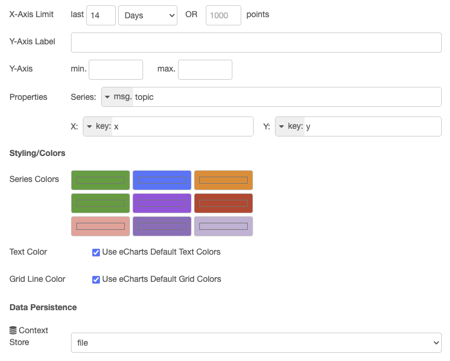

# Dashboard 2.0 Chart Persistence Patch

> ⚠️ **WORK IN PROGRESS - CONCEPT BETA** ⚠️
> 
> This is an experimental patch. Use at your own risk.  
> Not officially supported by FlowFuse or Node-RED.  
> Tested with @flowfuse/node-red-dashboard 1.30.0

---

Adds data persistence to **@flowfuse/node-red-dashboard** ui-chart nodes, allowing chart history to survive Node-RED restarts.

## Features

- **Context Store Persistence** - Save chart data to Node-RED file-based context store
- **Write-Behind Caching** - 60-second flush interval to protect SD cards
- **Automatic Retention** - Uses chart X-Axis Limit settings for data retention
- **Race Condition Protection** - Messages queued during history load
- **Multi-Series Support** - Works with single and multi-series charts
- **Seamless Restore** - Uses Dashboard 2.0 native widget-load mechanism

## Configuration

After installation, each ui-chart node has a new **Data Persistence** section:



### Context Store Dropdown

| Option | Description |
|--------|-------------|
| **Disabled** | No persistence (default) |
| **memory** | In-memory only, lost on restart |
| **file** | Persisted to disk, survives restart |

Options come from Node-RED settings.js contextStorage configuration.

### X-Axis Limit = Data Retention

The **X-Axis Limit** controls both chart display and data retention. Example: 14 Days limit means chart shows 14 days AND data older than 14 days is pruned on save.

## Installation

```bash
# 1. Install patch-package
cd /data
npm install patch-package --save-dev

# 2. Add to package.json
{
  "scripts": {
    "postinstall": "patch-package"
  }
}

# 3. Copy patch and apply
mkdir -p patches
cp @flowfuse+node-red-dashboard+1.30.0.patch patches/
npm run postinstall

# 4. Restart Node-RED
```

## How It Works

### Saving

When chart receives data, a 60-second flush timer is scheduled. After 60 seconds of idle time, data is pruned (removing points older than X-Axis Limit) and written to context store. On Node-RED shutdown, any pending data is saved immediately.

### Restoring

On Node-RED startup, chart loads data from context store asynchronously. Any incoming messages during load are queued to prevent race conditions. Once loaded, data is saved to Dashboard datastore and queued messages are processed. When browser connects, widget-load mechanism sends data to frontend automatically.

## Handling Dashboard 2.0 Updates

⚠️ **Patch is version-specific** - filename contains version number.

| Scenario | Result |
|----------|--------|
| Same version (reinstall) | ✅ Patch applies automatically |
| Patch version (1.30.0 → 1.30.1) | ⚠️ May work if code unchanged |
| Minor/Major update (1.30.0 → 1.31.0) | ❌ Patch fails - regenerate needed |

After update, if patch fails:
```bash
# Manually reapply changes to new version files, then:
npx patch-package @flowfuse/node-red-dashboard
# Creates new patch: patches/@flowfuse+node-red-dashboard+1.31.0.patch
```

## Compatibility

| Component | Version |
|-----------|---------|
| @flowfuse/node-red-dashboard | 1.30.0 |
| Node-RED | 3.x, 4.x |
| Context Stores | memory, file |

---

## For Dashboard 2.0 Developers

Consider adding native persistence support to ui-chart. This patch demonstrates a working implementation (~120 lines) that is non-breaking (disabled by default) and leverages existing Node-RED context store API.

**Links:**
- This patch: https://github.com/Koneisto/dashboard2-chart-persistence
- Dashboard 2.0: https://github.com/FlowFuse/node-red-dashboard

## License

MIT
